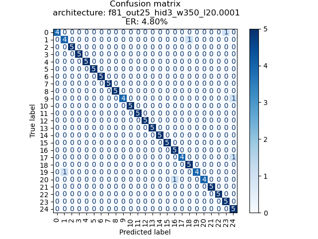

# Experiment on the King corpus

## Overview

This repository contains the lab report detailing the experiment conducted on the King Speaker Verification corpus. The study focuses on exploring different parameters of a neural network model architecture for speaker recognition.

## Abstract

The research delves into the King Speaker Verification corpus, specifically the Nutley, NJ, recordings from the International Telephone and Telegraph Corporation. The aim is to evaluate the error rate for a given neural network architecture, assessing various parameters' influence. The experiment yielded a significant improvement in speaker recognition tasks, achieving an error rate of 4.8%.

## Contents

### Introduction
Background on speech processing and the challenges of speaker recognition.
### Methods
Details on the King Speaker Verification corpus and the recognition process.
### Experiments
Exploration of the best parameters for the architecture.
### Results
Presentation of experiments with different architecture parameters and their outcomes.

### Discussion
Insights on the best-evaluated model and suggestions for future experiments.
